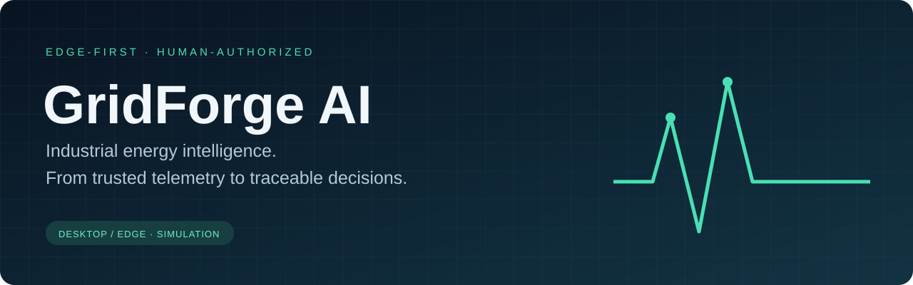
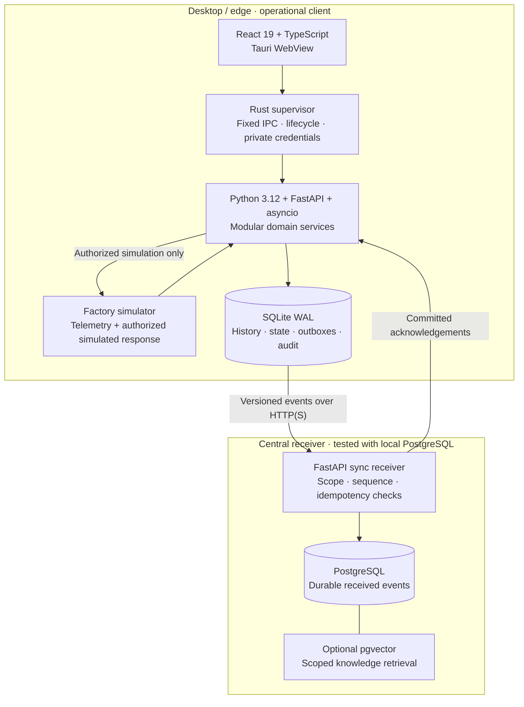

<p align="center">
  
</p>

<p align="center">
  <a href="https://github.com/KartikaySr/GridForge-AI/actions/workflows/ci.yml"></a>
  
  
  
</p>

<p align="center">
  <strong>Observe demand. Respect production constraints. Authorize explicitly. Verify the outcome.</strong><br />
  A desktop and edge prototype connecting industrial energy decisions to the evidence behind them.
</p>

<p align="center">
  <a href="#start-the-desktop">Quick start</a> ·
  <a href="#watch-the-complete-workflow">Demonstration</a> ·
  <a href="#architecture">Architecture</a> ·
  <a href="#verification-and-evidence">Evidence</a> ·
  <a href="#documentation-library">Documentation</a>
</p>

> **Project boundary:** Phase 11 completes the desktop **simulation** milestone. Factory inputs, equipment responses and financial amounts are synthetic. There is no physical OT write capability, industrial deployment claim or verified utility-bill saving. Forecasting uses a rolling mean; the advisory provider uses local extractive retrieval.

## The decision GridForge helps make

**Demand is approaching a configured limit. Which eligible loads can we reduce, by how much, and for how long—and did the approved adjustment actually produce the expected simulated result?**

An energy decision involves more than identifying a peak. Critical equipment may be unavailable for adjustment. Measurements may be stale. Connectivity may fail. A command acknowledgement may arrive even when measured performance still needs verification.

GridForge keeps those distinctions explicit. It joins local telemetry, evidence-gated forecasting, bounded optimization, operator approval, simulated execution and financial attribution in one traceable workflow. The desktop remains useful during cloud disconnection and synchronizes durable events after connectivity returns.

This is a working engineering prototype for plant operators and energy managers. General production scheduling, tariff arbitrage and real industrial VPP participation remain future work.

The current [desktop prototype scope](docs/00-master/DESKTOP_PROTOTYPE_SCOPE.md) covers local simulation workflows; web/mobile and the broader industrial product roadmap remain separate.

## What works today

- **Local telemetry:** approximately 1 Hz per simulated asset, bounded ingestion, deduplication, normalized units, mapping validation and durable history.
- **Quality-aware intelligence:** five-minute rolling-mean inputs, a 30-minute demand projection and explicit DEGRADED/UNKNOWN states when evidence is unsuitable.
- **Constrained proposals:** a deterministic continuous curtailment allocator with hard eligibility checks, bounded reductions and soft preference penalties.
- **Human-authorized simulation:** separate approval, permission checks, repeated validation, durable command states, acknowledgement and measured verification.
- **Financial attribution:** versioned synthetic tariffs, Decimal arithmetic, execution/rebound windows and distinct estimated versus verified simulated values.
- **Production reporting:** immutable local simulation reports, declared good/rejected output, complete-window electricity intensity and comparisons that withhold improvement claims when production regresses.
- **Durable synchronization:** seven versioned event streams, transactional outboxes, idempotent PostgreSQL receipt and visible backlog/conflict state.
- **Inspectable explanations:** constraint reasons, cited source excerpts and restricted SELECT-only reporting queries.
- **Demand-risk incidents:** durable source processing, revision-safe investigation/closure, explicit superseded evidence and no dispatch authority.
- **Command Center:** fresh simulated load, baseline forecast, threshold/headroom and an evidence-gated chart.
- **Desktop operations:** local accounts and roles, hash-chained audit, diagnostics, recovery tools and a packaged macOS application with an embedded Python runtime.

## Watch the complete workflow

Open **Integrated Demonstration** in the native application. The rehearsal uses a separate ephemeral database and an accelerated clock; it does not modify the normal facility's history.

1. **Normal factory:** generate five assets' measurements and establish usable demand evidence.
2. **Bad data:** inject BAD-quality samples; prediction becomes DEGRADED and risk becomes UNKNOWN.
3. **Demand peak:** accumulate elevated measurements, recover valid coverage and show a forecast threshold breach.
4. **Constrained proposal:** allocate eligible load reductions and expose why a critical asset is excluded.
5. **Explicit approval:** authorize the proposal in a separate operator action, then observe simulated dispatch and acknowledgement.
6. **Measured verification:** assess complete execution and rebound windows, then record explicitly simulated financial value.
7. **Explanation and audit:** retrieve cited domain evidence and inspect the recorded decision trail.
8. **Cloud interruption:** disconnect transport while local ingestion continues and pending events accumulate.
9. **Reconciliation:** reconnect to a real PostgreSQL-backed receiver and drain the backlog without duplicate inserts.

The final two desktop steps require separate receiver enrollment. An unconfigured desktop disables them. The acceptance runner provisions a temporary receiver automatically:

```sh
npm run demo:verify
```

It requires PostgreSQL `initdb` and `pg_ctl` on `PATH`, runs with explicit automated simulation approval, and writes `.local/phase11-demo.json`. Temporary receiver data is removed after execution. See the [complete demonstration guide](docs/06-engineering/PHASE_11_DEMONSTRATION.md).

**What this demonstrates:** actual domain services, SQLite persistence, authorization, simulator response, quality-gated measurement and HTTP/PostgreSQL reconciliation. Accelerated time does not establish real operator response-time guarantees, and a rolling mean does not anticipate an unseen spike.

## Architecture



The native layer owns transport credentials and supervises the Python process. React calls fixed native operations; it never connects directly to databases or OT. Domain rules live in Python services, while shared OpenAPI and event contracts define the client boundary.

SQLite provides explicit local continuity. The cloud receiver commits events before the edge acknowledges its outbox. Missing connectivity accumulates a durable backlog; scope, sequence or digest conflicts are surfaced rather than silently overwritten.

The runtime currently runs as a child of the desktop. **Closing the desktop stops the runtime.** Unattended edge hosting is a future deployment requirement. Current synchronization is edge-to-cloud; cloud-to-edge approvals and commands are not implemented.

### The decision chain

```mermaid
flowchart LR
    T[Telemetry] --> V[Validation] --> S[State]
    S --> F[Forecast] --> R[Risk] --> C[Constraints]
    C --> O[Optimization] --> P[Proposal] --> H[Authorization]
    H --> D[Simulated dispatch] --> A[Acknowledgement]
    A --> M[Verification] --> E[Simulated savings] --> L[Audit]
```



Models advise. Hard constraints and authorization remain authoritative. An acknowledgement is not verification, and an estimate is not a verified result.

### Engineering choices

**Forecasting — `rolling-mean-v1`.** Five valid minute bins produce a flat 30-minute projection. Each required asset needs at least 48 good distinct seconds per input minute. Evaluation supports MAE, RMSE, MAPE and threshold-breach comparison after the future horizon closes. No representative industrial accuracy benchmark or trained XGBoost/LightGBM model is claimed.

**Optimization — `bounded-curtailment-v1`.** Eligible assets are sorted by penalty and stable identity, then assigned reductions until the target is met. This solves the implemented separable continuous linear allocation problem. It is not a general mixed-integer production scheduler. Criticality, freshness, mapping revisions, load bounds, maintenance and simulated capabilities gate eligibility; unsupported minimum-run/off requirements fail closed.

**Advisory retrieval — `local-extractive-v1`.** Cited excerpts and deterministic token-hash vectors support inspectable answers. SQL analytics uses constrained templates and allowlisted views. No generative LLM is required, and the advisory component has no dispatch authority.

**Money and evidence.** Decimal arithmetic, versioned tariffs, input digests and measured execution/rebound windows preserve attribution. Short dispatch windows do not establish demand-charge savings.

## Start the desktop

The verified native platform is **macOS ARM64**. Install Xcode Command Line Tools, uv, Node/npm and Rust using the versions pinned in `.nvmrc`, `.python-version`, `package.json` and `rust-toolchain.toml`. PostgreSQL is optional for local desktop operation and required for the full cloud acceptance run. Other operating systems require separate native verification.

```sh
git clone https://github.com/KartikaySr/GridForge-AI.git
cd GridForge-AI
uv python install
npm ci
uv sync --locked
rustup show
npm run desktop:native
```

Create a local administrator on first launch; no default password is shipped. The desktop starts its own authenticated runtime. Do not separately start the legacy API or standalone simulator for this workflow.

For the regular facility workflow, allow five sufficiently complete minutes for forecast warm-up and configure a simulation demand threshold. For a faster guided walkthrough, use **Integrated Demonstration**.

<details>
<summary><strong>Browser preview and desktop packaging</strong></summary>

```sh
# Interface preview; native operational functions are unavailable
npm run desktop

# Development executable; requires the checkout and .venv
npm run desktop:build

# Standalone macOS application with embedded Python runtime
npm run desktop:package
```

The packaged application is produced under `apps/desktop/src-tauri/target/release/bundle/macos/`. It is ad-hoc signed. Developer ID signing, notarization and automatic updates remain separate release work. Build outputs and local databases are deliberately excluded from Git.

The older `apps/api` scaffold is not the native edge runtime and must not be exposed as a production service.

</details>

## Verification and evidence

```sh
# Formatting, lint, types, generated contracts, frontend/Python tests and UI build
npm run check

# Rust formatting, Clippy and native integration tests
npm run native:check

# Complete disposable simulation with a real PostgreSQL/HTTP receiver
npm run demo:verify
```

PostgreSQL tests require local server tools. Vector integration additionally requires pgvector; absent dependencies can cause skips, so inspect the test summary before claiming complete coverage. See [development instructions](docs/06-engineering/DEVELOPMENT.md) for test setup and the [completion report](docs/00-master/PHASE_11_COMPLETION_REPORT.md) for recorded results.

The [3 October 2026 local acceptance summary](docs/evidence/phase-11-acceptance.json) records **216 passing tests** across Python, frontend and Rust, plus packaging and frozen-runtime checks. The canonical scenario records **3,995 telemetry rows**, **4,041 acknowledged domain events**, **zero pending events** and a valid audit chain. These are local acceptance measurements, not production capacity guarantees.

The reference scenario produces **1.84 USD of verified SIMULATED net energy value** using a declared **0.15 USD/kWh synthetic tariff** and complete 60-second execution and rebound windows. The baseline is the pre-dispatch rolling-mean projection. This is neither a real utility saving nor a demand-charge calculation. Small differences between separately rounded monetary components and the rounded net are expected.

The [6 October reporting acceptance](docs/evidence/phase-12a-acceptance.json) records **227 passing tests** (182 Python, 42 frontend, 3 Rust), a rebuilt macOS package and clean-environment runtime smoke. See the [Phase 12A report](docs/00-master/PHASE_12A_COMPLETION_REPORT.md) for its local-only scope and remaining release gates.

### Failure behavior is part of the product

- Bad, stale or insufficient input → unavailable prediction / UNKNOWN risk.
- Ineligible asset or infeasible target → no executable proposal.
- Missing authority, stale evidence or failed revalidation → blocked dispatch.
- Acknowledgement without complete measurements → no verified savings claim.
- Cloud outage → local persistence plus a visible backlog.
- Conflicting event sequence or digest → quarantined stream, preserved evidence.

## Security and release boundaries

Local identities use salted password hashing, scoped permissions, expiring sessions and revocation. Native transport credentials stay out of React. Restricted reporting queries cannot become an OT write path. Audit records use append-only protections and a hash chain; a privileged machine owner is outside that local tamper-evidence guarantee.

Before an industrial deployment, the project needs site-specific commissioning, independent interlocks, credential lifecycle controls, unattended hosting, production distribution, external audit anchoring and operational validation. Existing dependency review findings are documented rather than suppressed. See [operations and release](docs/06-engineering/OPERATIONS_AND_RELEASE.md) and the [dependency review](docs/05-security/PHASE_10_DEPENDENCY_REVIEW.md).

See [Phase 12B acceptance](docs/00-master/PHASE_12B_COMPLETION_REPORT.md) for the latest 236-test source/native verification and prototype limits.

## Release scope and deployment preparation

The [three-client release scope](docs/00-master/RELEASE_SCOPE.md) records desktop gaps and the shared cloud, web and mobile acceptance gates. Recommended targets are GitHub Releases for desktop installers, Vercel for web, Render for the API/PostgreSQL, and Expo EAS plus the app stores for mobile. No hosted resources have been provisioned. Phase 12A adds [local production reporting](docs/06-engineering/PRODUCTION_REPORTING.md); it does not complete the full desktop specification.

## One platform, three future operating contexts

**Desktop / edge — implemented simulation:** plant-floor monitoring, constraints, local approval, simulated execution and local continuity.

**Web — planned:** headquarters visibility across facilities, financial review and governance through shared cloud read APIs and enterprise identity.

**Mobile — planned:** field observations, alerts and asset context, followed by narrowly scoped actions only after remote authorization and edge revalidation exist.

These are clients of shared contracts, not separate implementations of the domain rules. Start the next stage with enterprise identity and cloud read projections, then web visibility and mobile field workflows. The [corporate operating model](docs/08-future-clients/CORPORATE_OPERATING_MODEL.md) describes responsibilities, day-to-day workflows and delivery prerequisites.

## Repository map

```text
apps/desktop/          React UI, Tauri shell and Rust supervision
edge/                  Runtime composition, connectors and SQLite persistence
services/              Forecasting, risk, optimization, dispatch, finance and more
cloud/                 Scoped PostgreSQL synchronization receiver
database/migrations/   Central schema and optional AI reporting/vector support
packages/              Shared contracts, API client and design foundations
simulator/             Deterministic synthetic factory fixtures
scripts/               Packaging, acceptance, provisioning and verification tools
tests/                 Python unit and integration coverage
docs/                  Architecture, decisions, operating guides and phase evidence
```

## Documentation library

- **Start here:** [Context index](docs/00-master/CONTEXT_INDEX.md) and [product requirements](docs/01-product/DESKTOP_SRS.md).
- **Understand the system:** [Architecture](docs/02-architecture/SYSTEM_ARCHITECTURE.md), [domain/events](docs/02-architecture/DOMAIN_AND_EVENTS.md) and [architecture decisions](docs/09-decisions).
- **Inspect boundaries:** [API/event contracts](docs/07-contracts/API_EVENT_CONTRACTS.md), [shared platform contract](docs/08-future-clients/SHARED_PLATFORM_CONTRACT.md) and [security specification](docs/05-security/SECURITY_RBAC_SPEC.md).
- **Run and recover:** [Development](docs/06-engineering/DEVELOPMENT.md), [configuration](docs/06-engineering/CONFIGURATION_AND_HEALTH.md) and [operations](docs/06-engineering/OPERATIONS_AND_RELEASE.md).
- **Reproduce the milestone:** [Phase 11 walkthrough](docs/06-engineering/PHASE_11_DEMONSTRATION.md) and [completion evidence](docs/00-master/PHASE_11_COMPLETION_REPORT.md).
- **Plan the next clients:** [Desktop/web/mobile operating model](docs/08-future-clients/CORPORATE_OPERATING_MODEL.md).

Specifications contain future requirements as well as implemented behavior. Use completion reports and executable tests to establish current capability.

## Development approach

This is an AI-assisted project developed through phased implementation and validation. Changes should follow [AGENTS.md](AGENTS.md): preserve the decision chain, keep domain logic outside the UI, version contracts, test meaningful failure cases and document unfinished work. Never represent synthetic telemetry or simulated financial outcomes as real industrial evidence.

The desktop simulation is the reference implementation for the next stage of GridForge—not a claim that production commissioning or the complete VPP roadmap is finished.
