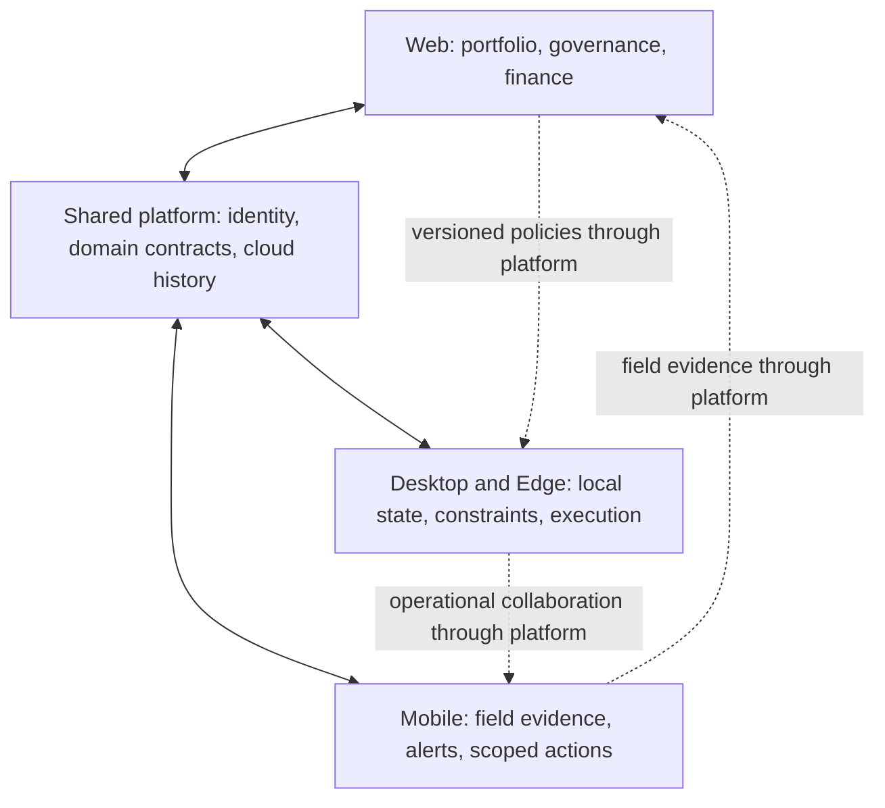

# GridForge corporate operating model: desktop, web and mobile

Status: next-stage architecture and product handoff after the desktop simulation milestone. Web and mobile are not implemented by this phase. This is an intended operating model, not a claim of existing enterprise deployment or physical OT authority.

## One platform, three working contexts

Desktop/Edge is the plant operating console. Web is headquarters and multi-site governance. Mobile is the field companion. These form a triangle of responsibilities around one platform, not three separate products or three independent sources of authority.

Solid bidirectional arrows describe the target design. Today, edge-to-cloud domain synchronization is implemented; cloud-to-edge policy/action delivery is not. Dotted arrows describe people collaborating, not direct network connections between clients. Neither web nor mobile talks directly to SQLite, Modbus, OPC UA or a dispatch adapter.

## Desktop/Edge: plant operations

Plant operators use the desktop for current telemetry quality, asset state, forecast/risk evidence, feasible proposals, local authorization and simulator dispatch verification. OT engineers configure equipment mappings and inspect connectivity. The edge enforces the actual current limits and retains the complete local history/outbox during outages.

A command can be acted upon only after current telemetry, asset availability, maintenance, policy revision, user authority and evidence freshness pass. Cloud requests must never bypass those checks. Real equipment writes remain a separate commissioning program involving site-specific engineering, interlocks, allowlists, bounded commands and validation.

The current desktop owns its child runtime: closing the application stops that process. An unattended corporate installation needs a separately supervised edge service (OS startup, health/recovery, secure local IPC and upgrade coordination) so ingestion continues without the UI. That service-host work is a prerequisite for claiming unattended plant continuity; it is not completed by the desktop package.

## Web: headquarters and governance

Corporate energy managers compare facilities, prioritize investigation, review trends and manage versioned policy proposals. Finance teams compare estimated and verified values by currency, tariff and evidence completeness; they never sum unlike currencies without an explicit conversion policy. Administrators manage organization membership and facility access. Auditors inspect decisions, identities, revisions, timestamps and measured outcomes.

Web reads cloud projections, each labeled with observation time, synchronization time, quality and freshness. It remains useful for received history when a site disconnects, while clearly marking current site status stale or unavailable. A green HTTP response is not evidence that the plant is live.

Initial web scope should be read-only portfolio, facility drill-down, history, synchronization status, financial evidence and audit. Policy authoring can follow with explicit publish/review/activation states. Remote commands and approvals must wait for the independent authority protocol described below.

## Mobile: field work and concise decisions

Technicians use mobile for assigned inspections, asset lookup, timestamped observations, notes/photos and maintenance feedback. Operators receive deduplicated alerts, acknowledge investigation and inspect concise contextual evidence. An alert acknowledgement must never be represented as dispatch approval or proof of resolution.

Offline notes can queue with client request UUIDs, original observation time and attachment upload status. A queued note must not silently become an operational override. Server validation binds the user to the asset's tenant/facility and retains conflict history. Attachments need access controls, bounded uploads, malware handling and retention policies.

The first mobile release should provide alerts, read-only facility/asset summaries and field reports. Approval becomes available only for specifically delegated roles, with fresh evidence, online verification and an implemented cloud-to-edge acknowledgement path. Offline dispatch approval is prohibited. Stale approvals are rejected rather than replayed when the device reconnects.

## A working day across three facilities

At shift handover, local operators open desktop and confirm telemetry quality and equipment restrictions. Headquarters uses web to inspect overnight outbox delays, unresolved incidents and incomplete savings cases. A disconnected plant is visible as stale, not silently counted as healthy.

During a morning inspection, a technician records a compressor issue on mobile. The platform stores the report and routes it for review. A responsible plant engineer validates it and applies a versioned availability or maintenance restriction. A field note alone does not directly stop machinery.

Before a scheduled high-load production period, web helps the energy manager compare facility risk and declared tariff windows. At the affected plant, edge forecasting and constraints determine whether any adjustment is feasible. Desktop exposes excluded critical assets and the impact of the proposed curtailment. An authorized operator approves only after reviewing the current evidence. The edge revalidates before dispatch and independently checks acknowledgement and response.

If the WAN fails, the plant retains local telemetry and authorized local simulation workflows. Web/mobile show their last received time and cannot treat cached state as live. An unreceived remote approval is pending delivery, never executed. On reconnect, ordered outboxes replay idempotently; cursor conflicts are quarantined for review.

After the event, verification waits for complete execution and rebound data. Web finance reports distinguish estimates, verified simulation amounts, incomplete cases and losses. Mobile can notify the responsible person of completion, but the financial result comes from the shared finance service. At shift close, all three interfaces refer to the same proposal, command, verification and incident identifiers.

## Ownership and decision boundaries

- Plant operator: local monitoring, investigation and explicitly assigned approvals; no organization-wide administration.
- OT engineer: mappings, device diagnostics and validated availability configuration; no automatic finance or user-admin rights.
- Facility manager: site policies and operational oversight within one assigned scope.
- Corporate energy manager: portfolio analysis and proposed policy changes across assigned facilities; no bypass of edge limits.
- Finance/analyst: evidence-based reporting and reconciliation; no equipment authority merely from access to financial data.
- Organization administrator: membership and role assignment; operational permissions remain explicit and auditable.
- Auditor: read-only evidence and provenance, with tenant/facility restrictions.

Use explicit permissions rather than equating a screen, device, or role name with authority. A local SUPER_ADMIN currently applies only to its installation; it is not already an enterprise administrator.

## Shared contracts and durable truth

Share IDs, enum vocabulary, versioned DTOs/events, units, UTC-at-rest conventions, Decimal currency strings, validation rules, error codes, idempotency keys and correlation IDs. Presentation uses facility timezones. Share pure formatting utilities and design tokens; keep Tauri/native IPC out of web/mobile modules.

The edge owns immediate operational state and local execution evidence. PostgreSQL is durable central truth for received enterprise history. SQLite and its outbox provide explicit continuity; this is not bidirectional last-write-wins replication. Current cloud storage is an event receiver. Query projections, enterprise user authentication, retention and reporting APIs need implementation before web can act as an operational enterprise console.

## Remote authorization protocol required before write-capable web/mobile

A cloud action request must contain an immutable request ID, tenant/facility/resource, intended action, proposal/command revision, policy/evidence versions, authenticated actor, issue/expiry times and bounded parameters. It needs server-side membership checks and an auditable signed trust relationship between central authority and the edge; local bearer transport credentials must never be reused as mobile credentials.

The target states are requested, authorized, delivered, accepted/rejected by edge, dispatched, acknowledged and verified. Cloud delivery is not dispatch. Edge acceptance requires current local checks and consumes an idempotent request. Revocation, duplicate delivery, clock skew, loss of acknowledgement, changed policies, expired evidence and conflict resolution require tests. Failures preserve evidence and never silently retry an expired actuation request.

## Recommended build order and acceptance gates

1. **Shared enterprise foundation:** central user identity/membership, permission mapping, tenant/facility enforcement and RLS tests; read projections with provenance/freshness; versioned cloud read APIs; headless edge-service design; contract compatibility tests.
2. **Web read-only release:** portfolio and facility views, risk/verification timelines, audit and sync health. Acceptance requires two genuinely isolated tenants, multiple facilities, no access to another tenant through identifiers, accurate stale states and no Tauri dependencies.
3. **Mobile field release:** authentication, asset views, alerts and idempotent offline reports. Acceptance covers lost-device/session revocation, network transitions, duplicate uploads, attachment controls and accessible field workflows.
4. **Governed writes:** policy proposals with explicit edge review/activation. Then, separately authorize remote approval work after the delivery/trust protocol passes failure tests.
5. **Commissioned OT pilot:** obtain representative data and site engineering approval before introducing physical write capabilities or making industrial savings claims.

Desktop simulation completion permits beginning these foundations. It does not certify enterprise identity, unattended edge hosting, remote actuation, predictive superiority, utility settlement or production distribution.
